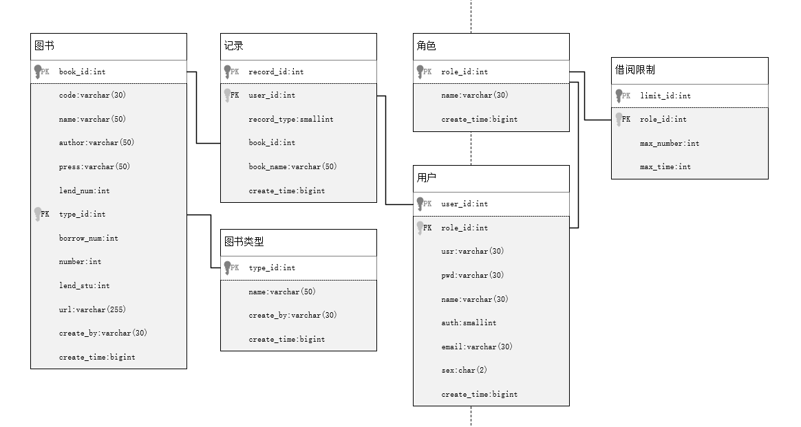
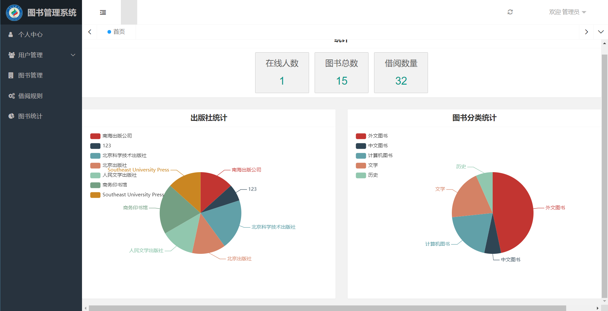
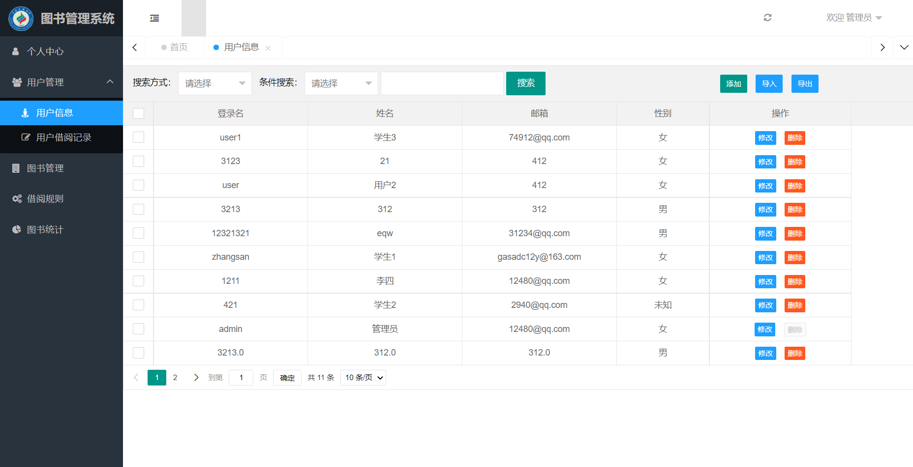
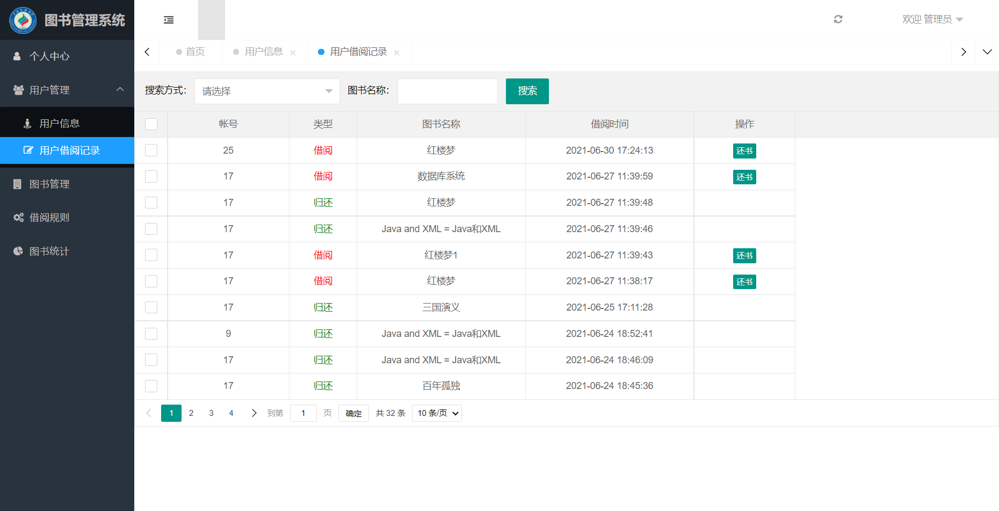
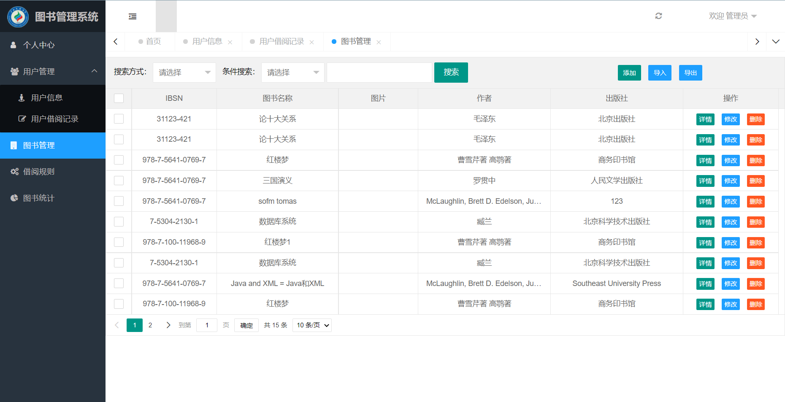
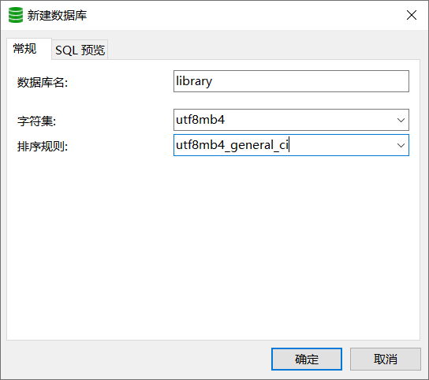
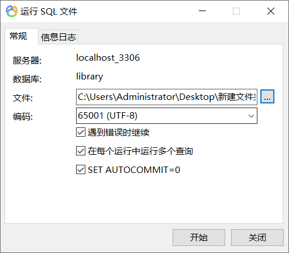
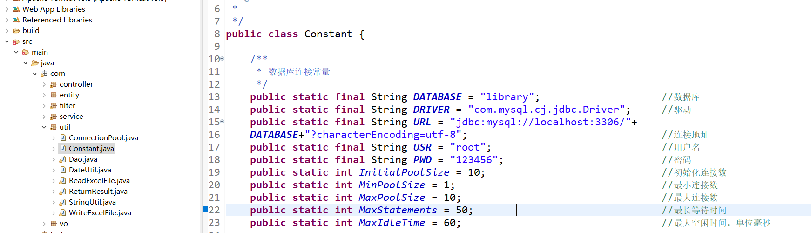

# 图书管理系统

#### 介绍
广西民族大学Java EE企业级开发期末课程设计

#### 需求

系统用户分为：借阅者（包括学生、教师及其他用户）、管理员

**借阅者的主要功能：**

（1）    个人信息管理：查看、修改个人基本信息；

（2）    查询图书、借书、还书、查询借阅记录、本人可借图书总数、目前在借的数量等；借阅图书时，学生借书限制：正在借阅的图书数量最多3本，每本图书借阅时间最多2个月；教师借书限制：正在借阅的图书数量最多5本，每本图书借阅时间最多3个月；其他用户借书限制：正在借阅的图书数量最多2本，每本图书借阅时间最多1个月；

**管理员的主要功能：**

（1） 图书信息的添加、修改、删除、查询（按书名、书号、作者、出版社等查询）、统计（可按图书类别：外文图书、中文图书、计算机图书、文学、历史……等统计；按出版社统计……）；

（2） 借阅者信息的添加、修改、删除、查询；借阅者借书限制条件的设定、查看与修改等。

（3） 图书借阅与归还登记、借阅者借阅记录查询（借阅时间、借阅图书……）、图书借阅查询（包括图书当前状态、被借阅次数、借阅时间、借阅者……）等

（4） 数据导入导出：从Excel导入用户信息与图书信息到数据库、将数据库中的用户信息与图书信息导出到Excel；

#### 技术栈

前端框架：layui

设计模式：MVC，java反射机制

连接池：c3p0

Excel文件导入导出：poi

#### 数据库设计

#### 页面展示

#### 安装教程

安装须知：本系统使用的数据库为mysql，若没有请自行百度解决连接数据库的问题。

环境：jdk版本为1.8，tomcat版本为8.5，项目版本为3.1

1. 导入数据库，数据库名称为library

   

   

2. 前往src中的util包的Constant.java，修改为本地的用户名和密码，如下图

   

3. 修改完选择WebContent中的login.jsp即可运行

